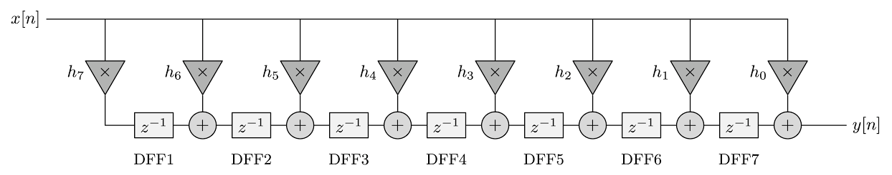
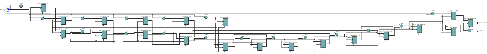
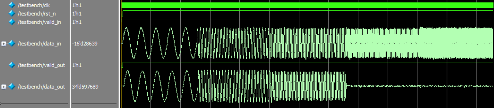
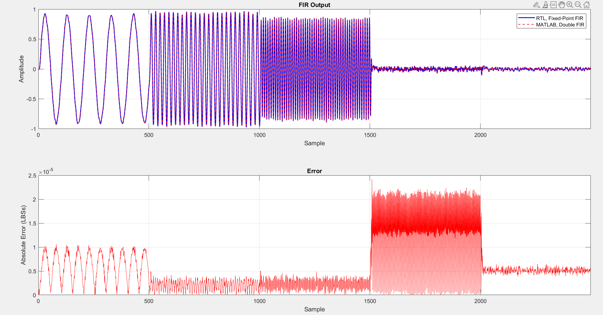

# Transposed FIR
A parameterizable transposed finite impulse response (FIR) implemented in SystemVerilog with verification using MATLAB scripts and SystemVerilog Testbench.

Clone the Repo:
```
git clone https://github.com/pletnevAE/FIR_transposed.git
```

## Contents
- [Overview](#overview)
- [Theoretical basis](#theoretical-basis)
  - [General FIR filter equation](#general-fir-filter-equation)
  - [Basic properties of FIR](#basic-properties-of-fir)
  - [Phase linearity](#phase-linearity)
  - [Transposed-Form](#transposed-form)
  - [Symmetry of coefficients](#symmetry-of-coefficients)
- [Architecture](#architecture)
- [Interface](#interface)
  - [Parameters](#parameters)
  - [Signals](#signals)
- [Utilization](#utilization)
- [Simulation](#simulation)
- [Building the project out-of-the-box](#building-the-project-out-of-the-box)

## Overview
The module is designed for high-speed digital filtering within FPGA-based digital signal processing (DSP) chains. The transposed form architecture targets maximum operational frequency ($F_{max}$) by eliminating long combinational adder trees and providing minimal pipeline latency. To reduce hardware resource usage (DSP blocks and logic), the design exploits symmetry of coefficients.

Typical applications:
+ Software Defined Radio (SDR);
+ Audio and Video signal processing;
+ Digital communications;
+ Medical equipment;
+ Radiolocation and navigation;
+ Industry.

## Theoretical basis
### General FIR filter equation
A finite impulse response (FIR) filter computes the output sequence $y[n]$ as a weighted linear combination of present and past input samples $x[n]$:

$$y[n] = \sum_{k = 0}^{N - 1}{h_k \cdot x[n-k]},$$

where $N$ is the number of filter taps (length of the impulse response), and $h[k]$ are the filter coefficients.

In the Z-domain, the transfer function $H(z)$ is represented as a polynomial in $z^{-1}$:

$$H(z) = \sum_{k = 0}^{N - 1}{h_k \cdot z^{-k}}$$

### Basic properties of FIR
+ FIR filters are always absolutely stable since they have no poles outside the origin;
+ with symmetric (or anti-symmetric) coefficients, the filter produces a strictly linear phase response (all frequencies are delayed by the same period of time);
+ the circuit does not use previous output values.

The disadvantage of FIR filters is their requirement of a higher-order filter and, consequently, more memory and computational resources compared to IIR filters in order to achieve a steep cutoff in the magnitude response.

### Phase linearity


To avoid phase distortion across frequency components, digital filters often require a constant group delay (linear phase response). A FIR filter exhibits strictly linear phase if its impulse response is symmetric (or anti-symmetric) arround its midpoint:

$$h[k] = h_{N - 1 - k}, \text{ for } k = 0, 1, ...,[\frac{N - 1}{2}].$$

### Transposed-Form
The transposed structure of a FIR filter is derived from direct form by applying the transposition theorem to the Signal Flow Graph (SFG):

1. reversing the direction of all signal paths;
2. replacing signal branching points with summing nodes and vice versa;
3. retaining the cpatial placement of delay elements $z^{-1}$ and multipliers.

Mathematically, the transposed difference equation is formulated as an accumulation cascade:

$$y[n] = h_0 \cdot x[n] + z_{0}[n - 1]$$

$$z_{k}[n] = h_{k + 1} \cdot x[n] + z_{k + 1}[n - 1], \text{ for } k = 0, 1, ...,N - 2$$

where $z_{N - 2} = h_{N - 1} \cdot x[n]$.

### Symmetry of coefficients
The accumulation operation is distributed along the delay path. Only a single adder is located between adjacent delay registers, eliminating deep combinational adder trees and enabling maximum $F_{max}$ with minimum circuit latency.

Unlike the direct form - where symmetry allows pre-additions prior to multiplication - the transposed form feed the input $x[n]$ simultaneously to all multipliers. However, coefficient symmetry $h_k = h_{N - 1 - k}$ still allows reduction of the number of physical multiplication operations (DSP blocks) from $N$ to $M = [\frac{N}{2}]$.

The input sample $x[n]$ is multiplied exclusively by the unique subset of coefficients $h[k]$, and the resulting products $M_{k}[n] = x[n] \cdot h_k$ are mapped (duplicated) to the corresponding accumulator cascade taps:

+ for an even number of taps ($N$ is even):
  
  The number of unique coefficients is $M = \frac{N}{2}$. The output sum is computed by the accumulation cascade, accounting for identical products across tap pairs $k$ and $N - 1 - k$:

$$M_{k}[n] = x[n] \cdot h_k, k = 0, 1, ..., \frac{N}{2} - 1$$

  Product terms $M_{k}[n]$ are routed to both the $k$-th and $(N - 1 - k)$-th accumulator cascade sections.

+ for an odd number of taps ($N$ is odd):

  The number of unique coefficients is $M = \frac{N + 1}{2}$. The central tap $k = \frac{N - 1}{2}$ has no symmetric pair:

$$M_{k}[n] = x[n] \cdot h_k, k = 0, 1, ..., \frac{N - 1}{2}$$

  For taps $k = 0, ..., \frac{N - 3}{2}$, products are routed to pair sections $k$ and $N - 1 - k$, whereas the central product $M_{\frac{N - 1}{2}}[n]$ feeds strictly into the middle cascade section.

## Architecture
  


The architecture consists of the following pipelined processing stages:
1. Multipliers: the input sample $x[n]$ is multiplied simultaneously across coefficients $h_k$.
2. Product Mapping: product terms are mapped across $N$ accumulation taps based on impulse response symmetry.
3. Transposed Accumulator Cascade: a chain of registers and adders computing partial sums from right to left: `acc[i] <= mult[i] + acc[i + 1]`. The implementation features **Tapered Accumulator Width**, gradually expanding accumulator registers towards the output to optimize Look-Up Tables and Flip-Flops utilization.
4. Output and Valid Pipeline: registers the final output $y[n]$ and propagates the data validity strobe `valid_in` $\rightarrow$ `valid_out`. The total latency from `in_valid` to `out_valid` is given by 
 
$${\mathrm{Latency}} = 1_{\mathrm{mult}} + 1_{\mathrm{acc}} + 1_{\mathrm{out}}.$$



Key implementation features:
+ Transposed-Form FIR;
+ Asynchronous Active-Low reset (`rst_n`);
+ Full parameterization of data and coefficient bit depths;
+ Taking into account the symmetry of FIR coefficients;
+ Optimal bit depths of multipliers and accumulators when calculating via a MATLAB script (**FIR_calc.m**);
+ Tapered accumulator bit-growth optimization;
+ Full pipelining of the FIR structure.

## Interface
### Parameters
Parameter values are passed to the top module using a **fir_params.vh** header file.
| Parameter | Description |
|:--:|:--:|
| `N_COEFFS` | Number of coefficients |
| `IN_WIDTH` | Input word length |
| `COEFF_WIDTH` | Coefficients word length |
| `MULT_WIDTH` | Product word length |
| `MULT_FRACTION` | Product fraction length |
| `ACC_WIDTH` | Accumulator word length |
| `OUT_WIDTH` | Output word length |
| `OUT_FRACTION` | Output fraction length |

### Signals
| Port | Direction | Width | Description |
|:--:|:--:|:--:|:--:|
| `clk` | Input | 1 | Clock signal |
| `rst_n` | Input | 1 | Asynchronous Active-Low Reset |
| `valid_in` | Input | 1 | Input data valid |
| `data_in` | Input | `IN_WIDTH` | Input data |
| `valid_out` | Output | 1 | Output data valid |
| `data_out` | Output | `OUT_WIDTH` | Output data |

## Utilization
The project was synthesized for the 10M50DAF484C6GES FPGA on the DE10-Lite board using Quartus 22.1 Standard Edition.
| FPGA | Option | `N_COEFFS` | `IN_WIDTH` | `OUT_WIDTH` | LUT | FF | DSP | Fmax, MHz | Hold Slack, ns | Setup Slack, ns |
|:--:|:--:|:--:|:--:|:--:|:--:|:--:|:--:|:--:|:--:|:--:|
| 10M50DAF484C6GES | **Transposed** | 12 | 16 |34 | 609 | 608 | 12 | 237.42 | 0.365 | 15.788 |
| 10M50DAF484C6GES | Direct-Form | 12 | 16 |34 | 565 | 564 | 12 | 190.44 | 0.363 | 14.749 |
| 10M50DAF484C6GES | **Transposed** | 20 | 16 | 34 | 1014 | 1013 | 20 | 204.75 | 0.364 | 15.116 |
| 10M50DAF484C6GES | Direct-Form | 20 | 16 | 34 | 996 | 995 | 20 | 171.47 | 0.362 | 14.168 |
| 10M50DAF484C6GES | **Transposed** | 28 | 16 | 34 | 1408 | 1407 | 28 | 220.75 | 0.364 | 15.470 |
| 10M50DAF484C6GES | Direct-Form | 28 | 16 | 34 | 1365 | 1364 | 28 | 162.00 | 0.363 | 13.827 |
| 10M50DAF484C6GES | **Transposed** | 55 | 16 | 34 | 2743 | 2742 | 56 | 171.94 | 0.362 | 14.184 |
| 10M50DAF484C6GES | Direct-Form | 55 | 16 | 34 | 2674 | 2673 | 56 | 162.92 | 0.360 | 13.862 |
| 10M50DAF484C6GES | **Transposed** | 168 | 16 | 35 | 8371 | 8370 | 160 | 164.96 | 0.363 | 13.938 |
| 10M50DAF484C6GES | Direct-Form | 168 | 16 | 35 | 8412 | 8410 | 168 | 123.95 | 0.350 | 11.932 |

## Simulation
Before running simulation, a MATLAB script **FIR_calc.m** is used to generate stimulus signal, **fir_params.vh** header file and file with coefficients. The script also places the magnitude response graph in .png format in the specified directory.

After placing the generated files into the project root folder, it is necessary to set the required parameters in the SystemVerilog **testbench.sv**. By default, parameters are taken from the **fir_params.vh**.

| Parameter | Default Value | Description |
|:--:|:--:|:--:|
| `N_COEFFS` | - | Number of coefficients |
| `IN_WIDTH` | - | Input word length |
| `COEFF_WIDTH` | - | Coefficients word length |
| `MULT_WIDTH` | - | Product word length |
| `MULT_FRACTION` | - | Product fraction length |
| `ACC_WIDTH` | - | Accumulator word length |
| `OUT_WIDTH` | - | Output word length |
| `OUT_FRACTION` | - | Output fraction length |
| `CLK_PERIOD` | - | Clock period in ns |
| `CLK_ENABLE_DIV` | - | Clock division factor for determining the clock enable frequency |
| `RESET_CYCLES` | 10 | Number of clock cycles before reset release |
| `NUM_SAMPLES` | - | Number of stimulus samples |



Upon completion of the simulation, file with FIR output samples will be created at the path specified in the **testbench.sv** (defined within the *initial* block when opening the files).

A MATLAB script **FIR_analyze.m** is used to analyze the obtained results. It reads files generated during the simulation, calculates an FIR filter with double-type coefficients based on the given characteristics, determines the absolute and RMS error, SQNR (Signal-to-quantization-noise ratio).

Upon completion, the script plots the RTL FIR output signal alongside the reference FIR output, as well as the absolute errors.



The calculated values for these parameters are also displayed in the console:
```
==================== FIR REPORT ====================
Filter Type                  : lowpass
Filter Order                 : 167
Numerator Word Length        : 16
Numerator Frac. Length       : 17
Input Word Length            : 16
Input Frac. Length           : 15
Output Word Length           : 35
Output Frac. Length          : 32
Product Word Length          : 31
Product Frac. Length         : 32
Accum. Word Length           : 35
Accum. Frac. Length          : 32
Theoretical Error            : 8.538448e-05
Theoretical SQNR             : 81.87 dB
----------------------------------------------------
Maximum Absolute Error      : 5.091071e-05
RMS Error                   : 1.718218e-05
Actual Measured SQNR        : 89.13 dB

====================================================
```

## Building the project out-of-the-box
Scripts **run_build.bat**, **build.tcl**, **timing.tcl** and **sim.tcl** are implemented for building the project out-of-the-box. The script also starts the generation of the necessary files (**FIR_calc.m**), simulation in Modelsim and comparison of the FIR outputs with the reference model (**FIR_analyze.m**). For the scripts to work, the path to the **bin64** folder within the Quartus root directory must be included in the `PATH` environment variable in Windows.

To run the script, you need to enter the following in the command line from the directory **scripts**:
```
run_build.bat <build_path> -F_CLK <value> -F_S <value> -FILTER_TYPE <string> -F_PASS <value> -F_STOP <value> -F_PASS1 <value> -F_PASS2 <value> -F_STOP1 -F_STOP2 -A_PASS <value> -A_STOP <value> -A_PASS1 <value> -A_PASS2 <value> -A_STOP1 <value> -A_STOP2 <value> -IN_WL <value> -IN_FL <value> -H_WL <value>
```

To get help on the script, you need to enter the following in the command line:
```
run_build.bat <build_path> --help
```

Setting the parameter flags is not necessary; if one of them (or all of them) is not set, the parameter will take on the default value.

The scripts output project build information, a Compilation Report, STA results to the console and MATLAB chart.